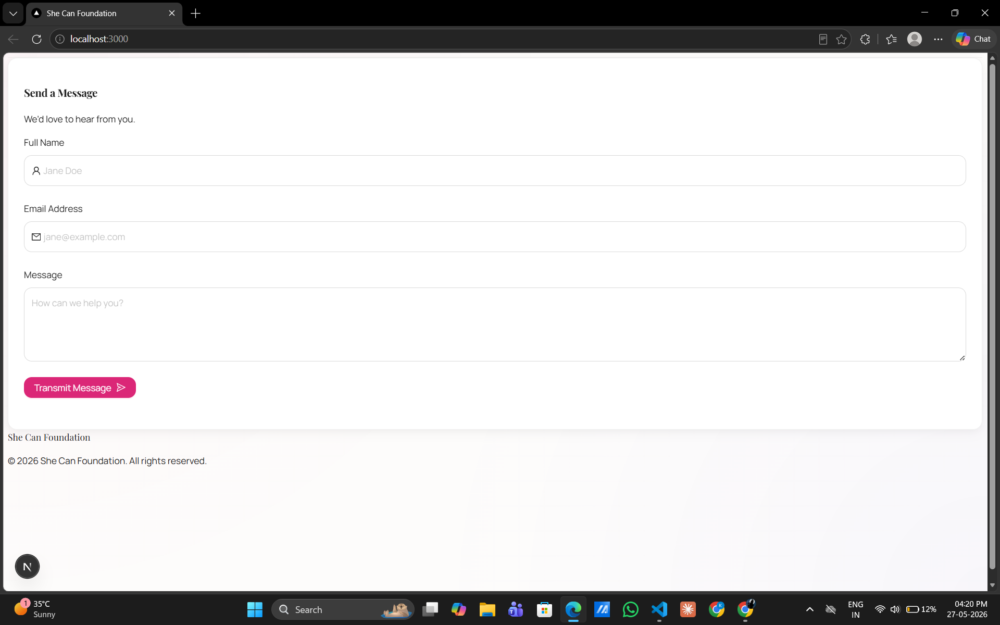

# She Can Foundation - Contact Portal

A modern, high-performance contact management system built with Next.js 15, featuring a stunning glassmorphism UI and robust form validation.



## 🌟 Key Features

- **Visually Stunning UI**: Modern design using Tailwind CSS v4, featuring glassmorphism effects, smooth animations, and a refined "She Can" brand identity.
- **Robust Validation**: Powered by **React Hook Form** and **Zod** for real-time, user-friendly field validation.
- **React 19 Ready**: Fully compatible with the latest React 19 features and Ant Design 5 integration.
- **Type-Safe API**: Next.js App Router API routes with Zod schema verification for both frontend and backend parity.
- **Database Integration**: Mongoose-based MongoDB connection for persistent storage of inquiries.
- **Accessible Design**: Carefully chosen typography (Manrope & Playfair Display) and high-contrast color palettes.

## 🚀 Tech Stack

- **Framework**: [Next.js 15 (App Router)](https://nextjs.org/)
- **UI Components**: [Ant Design 5](https://ant.design/)
- **Styling**: [Tailwind CSS v4](https://tailwindcss.com/)
- **Form Management**: [React Hook Form](https://react-hook-form.com/)
- **Validation**: [Zod](https://zod.dev/)
- **Database**: [MongoDB](https://www.mongodb.com/) with [Mongoose](https://mongoosejs.com/)
- **Fonts**: Google Fonts (Manrope, Playfair Display)

## 🛠️ Getting Started

### Prerequisites

- Node.js 18.x or later
- MongoDB instance (Local or Atlas)

### Installation

1. Clone the repository:
   ```bash
   git clone <repository-url>
   cd She_Can
   ```

2. Install dependencies:
   ```bash
   npm install
   ```

3. Set up environment variables:
   Create a `.env.local` file in the root directory:
   ```env
   MONGODB_URI=your_mongodb_connection_string
   ```

4. Run the development server:
   ```bash
   npm run dev
   ```

5. Open [http://localhost:3000](http://localhost:3000) in your browser.

## 📁 Project Structure

```text
src/
├── app/               # Next.js App Router (Layouts, Pages, API)
│   ├── api/contact/   # Contact submission endpoint with Zod validation
│   └── globals.css    # Tailwind v4 configuration & global styles
├── components/        # Reusable UI components (ContactForm)
├── lib/               # Shared utilities
│   ├── dbConnect.ts   # Database connection logic
│   └── models/        # Mongoose schemas (Contact)
```

## 📜 License

Distributed under the MIT License. See `LICENSE` for more information.

---
Built with ❤️ for the She Can Foundation.
